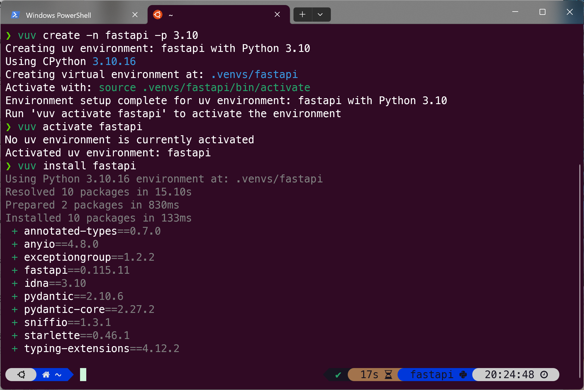
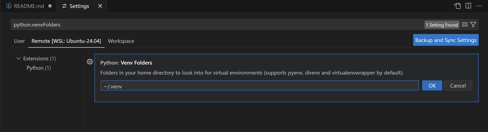

# VUV
Easier use of package manager uv in the form of conda.<br>And this only need is uv.

# First of All
Thanks [Menghuan1918](https://github.com/Menghuan1918) create awsome shell script.

## Installation
First you need to install package manager [uv](https://github.com/astral-sh/uv).

Then run:

```bash
git clone https://github.com/Slipstream-Max/vuv.git
cd vuv
bash Install.sh
```

Just restart your terminal. I've tested it on: 
- bash(Linux)
- zsh(Linux)

Or you can download the `vuv` file separately and add `source /path/to/vuv` `export VUV_VENV=/path/to/venvs` to your terminal configuration.

You can modify

VUV_VENV:path to venv

VUV_DIR:path to vuv file

in install.sh to choose different install location.

## Use


### Create a virtual environment named fastapi with Python version 3.10

```bash
vuv create -n fastapi -p 3.10
```

### Activate the environment you just created
```bash
vuv activate fastapi
```

### Deactivate this environment
```bash
vuv deactivate
```

### Remove this environment
```bash
vuv remove -n fastapi
```

### List all vuv enviroment
```bash
vuv list
```

For more details you can refer to `vuv help`.

### Use in VSCode

Ctrl+, open Settings search python.venvFolders click Add Item and input VUV_VENV path.


